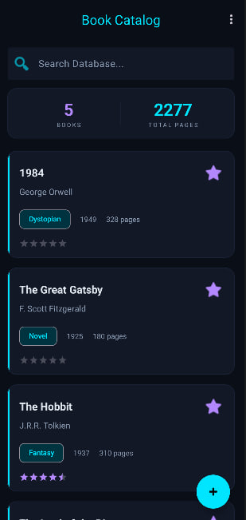

# BookCatalog



BookCatalog is a native Android application designed for managing a personal library of books. It features a modern, high-tech "cyber" aesthetic with smooth animations, dark mode default, and a robust local database.

## Overview

The app is built as a learning project to demonstrate Android architecture best practices, local data persistence, and modern UI/UX design using Material 3. Everything runs locally on the device with no backend dependency required.

## Core Features

### Book Management (CRUD)
- Add new books with detailed metadata (Title, Author, Year, Genre, Pages, Rating).
- Read and browse the entire collection in a scrollable list.
- Update existing book details easily.
- Delete (Purge) books from the database with confirmation.

### Search, Sort & Filter
- Real-time search bar to instantly find books by Title or Author.
- Sort the library by Title (A-Z), Publication Year (Newest first), or Evaluation Score (Rating).
- Toggle "Favorite" status for quick visual identification.

### High-Tech UI & Aesthetics
- Forced dark mode ("Cyber" theme) with deep space backgrounds and neon cyan/purple accents.
- Glassmorphism effects on cards (translucent backgrounds with thin neon borders).
- Smooth `SlideInUp` entry animations for the book list.
- Dynamic statistics dashboard showing total entities and volume pages.
- Thematic vector illustrations for empty database states.

## Architecture

The project is structured by architectural layers to ensure separation of concerns:

```text
app/src/main/java/com/ua/bookcatalog/
  data/           # Data layer (Room Database)
    Book.java         # Entity model
    BookDao.java      # Data Access Object (Queries)
    BookDatabase.java # Room Database instance manager
  ui/             # Presentation layer
    MainActivity.java       # Main list and dashboard
    AddEditBookActivity.java# Data entry form
    BookInfoActivity.java   # Detail view
    BookAdapter.java        # RecyclerView adapter
```

## Technology Stack

- **Language:** Java
- **Minimum SDK:** 26 (Android 8.0)
- **Target SDK:** 36
- **UI Framework:** Android View System + Material 3 Components
- **Local Database:** Room (`androidx.room`)
- **Lists & Animations:** RecyclerView + `recyclerview-animators` (jp.wasabeef)
- **Build System:** Gradle (Kotlin DSL)

## Getting Started

### Prerequisites

- Android Studio (Ladybug or newer recommended)
- Java Development Kit (JDK) 11 or higher (bundled with Android Studio)
- Android SDK Platform 36

### Install & Run

1. Clone or download the repository.
2. Open the project folder `BookCatalog` in Android Studio.
3. Click **Sync Project with Gradle Files** (the elephant icon) to download Room and Animator dependencies.
4. Select an emulator or physical device.
5. Click **Run** (`Shift + F10`).

### Test Data
To quickly populate the app and test the UI, tap the three-dot menu in the top right corner of the main screen and select **"Fill Test Data"**.

## Data & Privacy

- All book data is stored locally in an SQLite database on the user's device via Room.
- No backend servers, cloud storage, or analytics tracking are used.
- The app requests `INTERNET` permission solely as a fallback for dynamic asset loading, but core operations function 100% offline.
